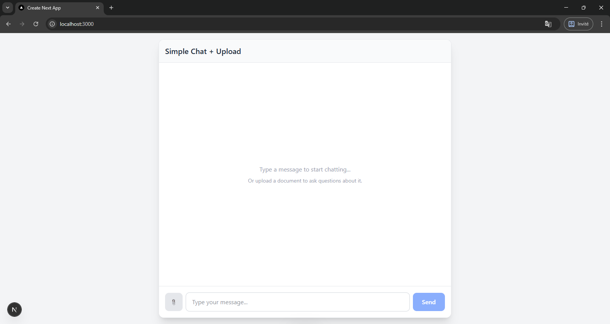

# Pilaw - RAG Chat Application



## 🚀 Overview
**Pilaw** is a modern, AI-powered chat application featuring a robust **Retrieval-Augmented Generation (RAG)** system. It enables users to upload documents and interact with them via an intelligent LLM interface.

Built with **Next.js 14**, **LangChain**, **Supabase**, and **Cohere**, this project demonstrates a complete end-to-end flow from document ingestion to context-aware answer generation.

## ✨ Key Features

### 💬 Intelligent Chat Interface
- **Real-time Streaming**: Instant responses using `streamText` from Vercel AI SDK.
- **Minimalist Design**: Clean, responsive UI built with Tailwind CSS.
- **Simple & Fast**: No unnecessary complexity—just you and the AI.

### 📄 Document Ingestion (RAG)
- **File Upload**: Upload PDFs and text files directly via the chat interface (📎 button).
- **Unstructured API**: High-quality text extraction from complex documents.
- **Hybrid Search**: Combines **Semantic Search** (Embeddings) and **Keyword Search** (Full-Text) via Supabase for maximum retrieval accuracy.
- **Reranking**: powered by **Cohere**, ensuring the LLM only sees the most relevant context.

### 🛠 Tech Stack
- **Frontend**: Next.js 14 (App Router), React, Tailwind CSS.
- **Backend/API**: Next.js API Routes.
- **AI Orchestration**: LangChain, Vercel AI SDK (@ai-sdk/twitter).
- **Database (Vector Store)**: Supabase (pgvector).
- **Reranker**: Cohere API.
- **Model**: OpenAI GPT-4o via AI Gateway.
- **Deploy**: Vercel (Ready).

## 🚀 Getting Started

### Prerequisites
- Node.js 18+
- pnpm

### Installation

1. **Clone the repository**:
   ```bash
   git clone https://github.com/user257814938/Pilaw_RAG.git
   cd pilaw
   ```

2. **Install dependencies**:
   ```bash
   pnpm install
   ```

3. **Configure Environment**:
   Create a `.env.local` file with your keys:
   ```env
   NEXT_PUBLIC_SUPABASE_URL=...
   SUPABASE_SERVICE_ROLE_KEY=...
   OPENAI_API_KEY=...
   COHERE_API_KEY=...
   UNSTRUCTURED_API_KEY=...
   ```

4. **Run Development Server**:
   ```bash
   pnpm dev
   ```
   Open [http://localhost:3000](http://localhost:3000) to see the app.

## 📸 How it Works
1. **Upload**: Drag & drop or click the clip button to upload a file.
2. **Process**: The file is sent to Unstructured -> Text extracted -> Vectors stored in Supabase.
3. **Chat**: Ask a question. The system searches Supabase -> Reranks with Cohere -> Sends context + question to GPT-4o.
4. **Result**: You get a precise, sourced answer.

---
*Created with ❤️ by the Pilot Team*
